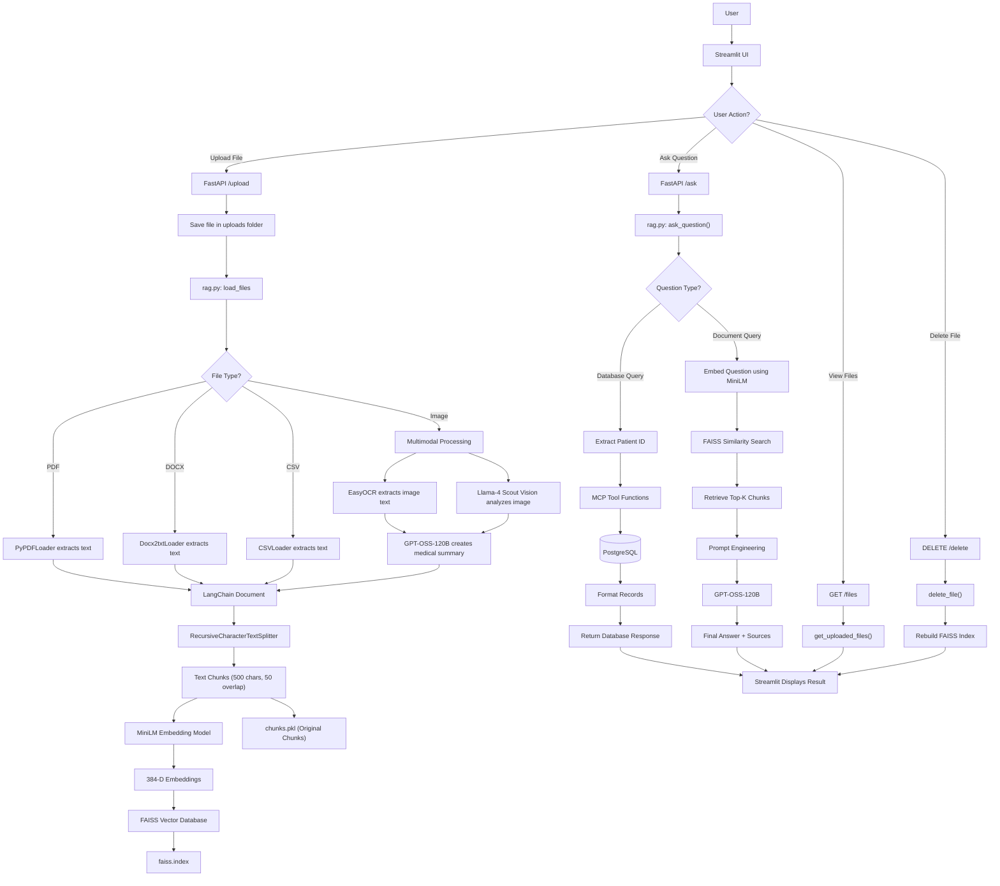

# MediAssist AI - System Architecture

## End-to-End Workflow

```mermaid
flowchart TD
    A["User"] --> B["Streamlit UI"]

    B --> C{"User Action?"}

    C -->|"Upload File"| D["FastAPI /upload"]
    D --> E["Save file in uploads folder"]
    E --> F["rag.py: load_files"]
    F --> G{"File Type?"}

    G -->|"PDF"| H["PyPDFLoader extracts text"]
    G -->|"DOCX"| I["Docx2txtLoader extracts text"]
    G -->|"CSV"| J["CSVLoader extracts text"]
    G -->|"Image"| K["Multimodal Processing"]

    K --> L["EasyOCR extracts image text"]
    K --> M["Llama-4 Scout Vision analyzes image"]
    L --> N["GPT-OSS-120B creates medical summary"]
    M --> N

    H --> O["LangChain Document"]
    I --> O
    J --> O
    N --> O

    O --> P["RecursiveCharacterTextSplitter"]
    P --> Q["Text Chunks (500 chars, 50 overlap)"]
    Q --> R["MiniLM Embedding Model"]
    R --> S["384-D Embeddings"]
    S --> T["FAISS Vector Database"]
    Q --> U["chunks.pkl (Original Chunks)"]
    T --> V["faiss.index"]

    C -->|"Ask Question"| W["FastAPI /ask"]
    W --> X["rag.py: ask_question()"]
    X --> Y{"Question Type?"}

    Y -->|"Database Query"| Z["Extract Patient ID"]
    Z --> AA["MCP Tool Functions"]
    AA --> AB[("PostgreSQL")]
    AB --> AC["Format Records"]
    AC --> AD["Return Database Response"]

    Y -->|"Document Query"| AE["Embed Question using MiniLM"]
    AE --> AF["FAISS Similarity Search"]
    AF --> AG["Retrieve Top-K Chunks"]
    AG --> AH["Prompt Engineering"]
    AH --> AI["GPT-OSS-120B"]
    AI --> AJ["Final Answer + Sources"]

    AD --> AK["Streamlit Displays Result"]
    AJ --> AK

    C -->|"View Files"| AL["GET /files"]
    AL --> AM["get_uploaded_files()"]
    AM --> AK

    C -->|"Delete File"| AN["DELETE /delete"]
    AN --> AO["delete_file()"]
    AO --> AP["Rebuild FAISS Index"]
    AP --> AK
```
